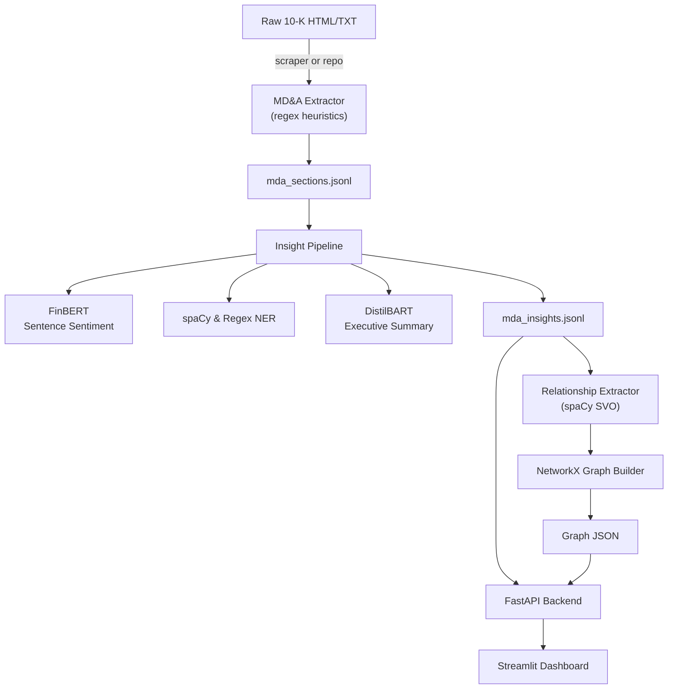
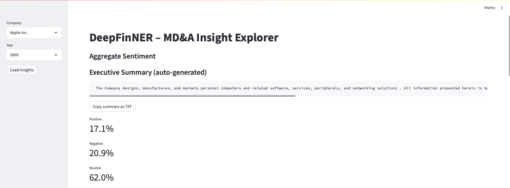
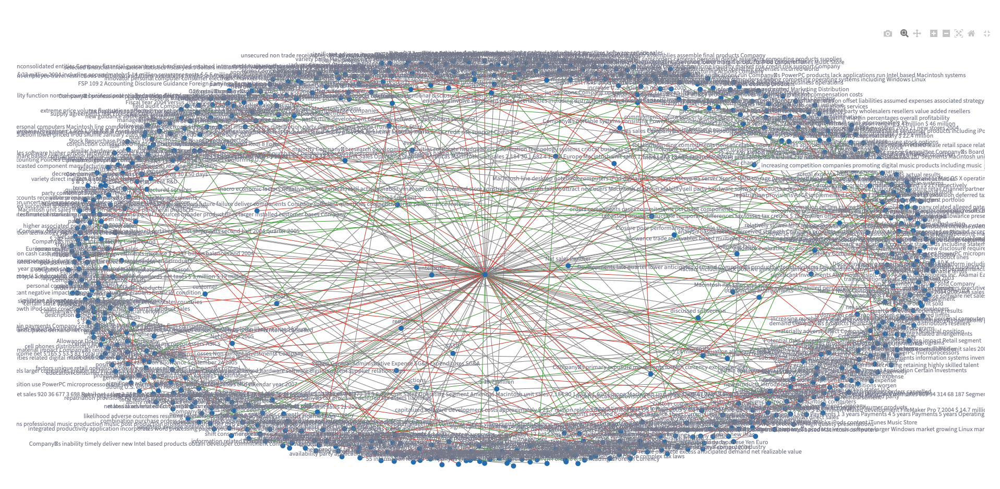
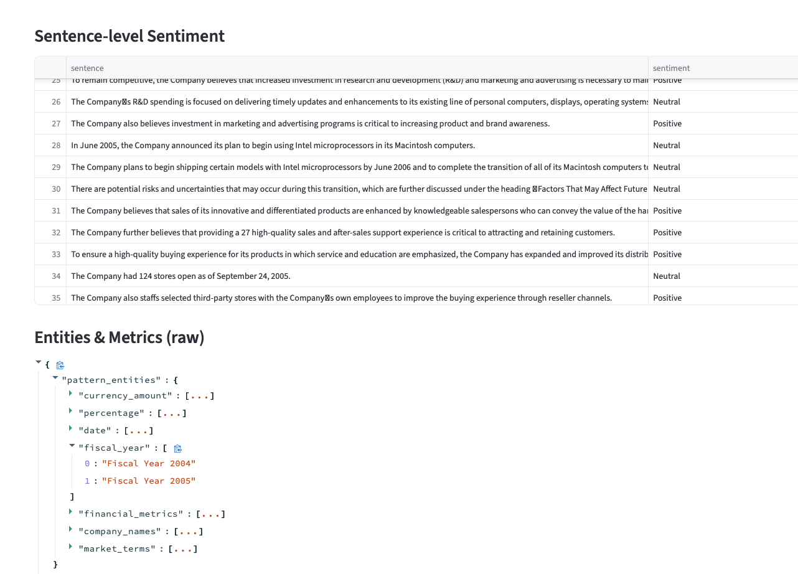

# DeepFinNER – MD&A Insight Prototype

A proof-of-concept that shows how NLP, NER, summarisation, sentiment, graphs can turn raw SEC 10-K filings into analyst-ready insight in minutes.

## 📐 Architecture at a Glance


(The same diagram is rendered in the project wiki.)

1. **Scraper / Data Lake** – Raw 10-K HTML & TXT already present in `Scrape_Data_New/10_k/…`.
2. **MD&A Extractor** (`src/mda_extractor.py`)
   • Regex heuristics to find the start:
     `item\s+7[^a-zA-Z]{0,10}management … discussion … analysis`
   • Stops at `Item 7A` or `Item 8` headings.
   • Fallback to BeautifulSoup-stripped plain text.
3. **Pipeline – Stage 1** (`src/pipeline_mda.py`)
   • Saves each extracted section to JSONL with CIK & date.
4. **Pipeline – Stage 2** (`src/insight_pipeline.py`)
   • FinBERT for sentence-level tone.
   • spaCy + regex for financial NER.
   • DistilBART for 120-word executive summary.
   • Outputs `mda_insights.jsonl`.
5. **Relationship Graph** (`src/graph_pipeline.py`)
   • spaCy dependency parse → subject-verb-object triples.
   • NetworkX builds a directed multigraph.
   • Edge attributes: `{verbs, sent_positive, sent_negative, sent_neutral}`.
6. **Service Layer** (`services/api.py`)
   • FastAPI endpoints: `/mda`, `/insights`, `/graph`.
7. **UI Layer** (`ui/app.py`)
   • Streamlit dashboard with
     – Executive summary & sentiment gauges
     – Interactive Plotly graph (edges colour-coded by sentiment)
     – Searchable sentence table & raw entity JSON.

## ⚙️ Heuristics & Tricks

| Problem | Heuristic |
|---------|-----------|
| MD&A delimitation | Flexible regex accepts dots, dashes or colons after “Item 7”; end regex requires punctuation after “Item 7A/8” to avoid false stops e.g. “…Item 8 of this Form 10-K”. |
| Over-length sentences for FinBERT (512 token cap) | Sentences >512 tokens are chunked into 256-token slices before inference. |
| Executive summary latency | Input text is truncated to 4 000 chars (≈1 000 tokens) before passing to DistilBART; good enough for coherent TL;DR in <2 s on M-series Macs. |
| Graph edge sentiment | Edge colour = green if `sent_positive>sent_negative`, red if vice-versa, grey otherwise. |
| Package discovery in Streamlit | Project root added to `sys.path` at runtime so `src.*` imports resolve no matter where the app is launched. |

## 🏃 Quick Start

```bash
# one-time setup
python -m pip install -r requirements.txt
python -m spacy download en_core_web_sm

# build artefacts (≈10 min first run)
python -m src.pipeline_mda
python -m src.insight_pipeline
python -m src.graph_pipeline

# serve
uvicorn services.api:app --reload &   # backend on :8000
streamlit run ui/app.py               # dashboard on :8501
```

## 📂 Repository Map (key parts)

```
src/
  mda_extractor.py      # regex extraction heuristics
  pipeline_mda.py       # stage-1 pipeline
  insight_pipeline.py   # sentiment, NER, summary
  relationship_extractor.py
  graph_pipeline.py     # builds NetworkX graph
services/api.py         # FastAPI layer
ui/app.py               # Streamlit dashboard
```

## 📝 Future Enhancements (open PRs welcome!)

* KPI spotlight – parse numeric metric sentences → YoY deltas table.
* Risk-factor radar – word-cloud + clickable sentences.

## 📸 Screenshots


| Dashboard landing | Relationship graph | Sentence sentiment & entities |
|---|---|---|
|  |  |  |


---

🛈 **Prototype limitations**

This regex-driven extractor works on the vast majority of 10-K filings from 2000-2018, but some reports have unusual formatting that may defeat the current heuristics. For demo purposes we recommend selecting **Apple Inc. 2005** (CIK 0000320193) in the dashboard—it showcases the full pipeline with rich sentiment mix, entities, and graph.

Future work: smarter HTML‐aware extraction and automatic heuristic tuning based on failure logs. 
## Update log

- 10 Nov 2024 – README refreshed for public release
